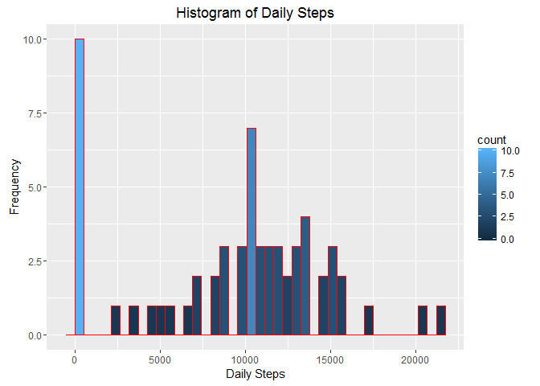
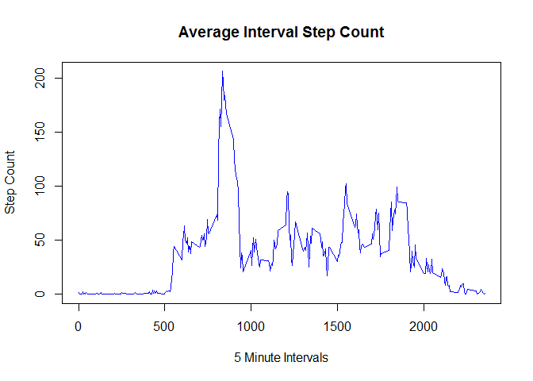
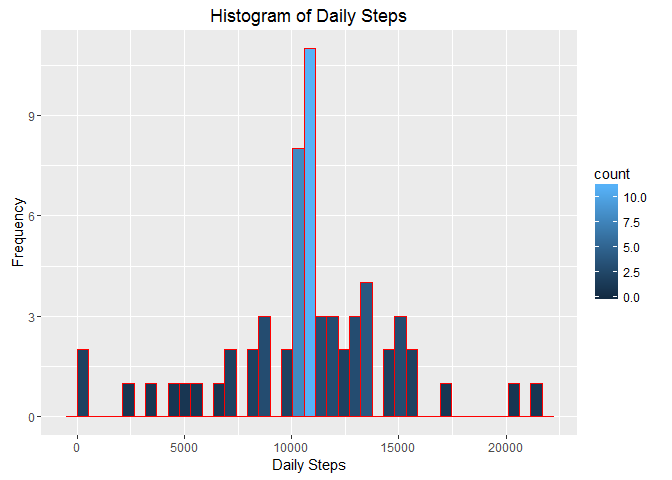
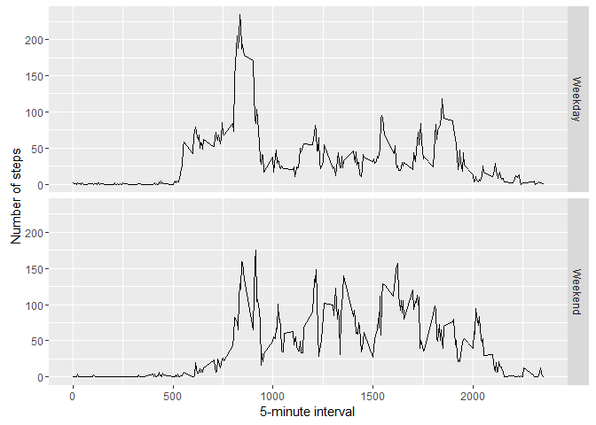

# Reproducible Research: Peer Assessment 1
This Report has been compiled to review the analysis performed using a fitness tracker dataset that collected steps taken by an anonymous individual for a two month period.  Steps were captured in five minute intervals providing 288 observations per day

## Loading and preprocessing the data
I'm using the dplyr anmd ggplot2 libraries in addition to the base R package in order to build the plots and perform the analyses in this report.
The file repdata-data-activity.zip has already been downloaded to the current working directory.  We first must unzip the file and read in the encapselated .csv file to a data frame


```r
        library(dplyr)
```

```
## 
## Attaching package: 'dplyr'
```

```
## The following objects are masked from 'package:stats':
## 
##     filter, lag
```

```
## The following objects are masked from 'package:base':
## 
##     intersect, setdiff, setequal, union
```

```r
        library(ggplot2)
        zfile<-"repdata-data-activity.zip"
##read and unzip file
##store results in dataframe 'act'        
        
        act<-read.csv(unz(zfile,"activity.csv"))
        act$date<-as.POSIXct(act$date)
```
Basic file elements are as follows:


```r
str(act)
```

```
## 'data.frame':	17568 obs. of  3 variables:
##  $ steps   : int  NA NA NA NA NA NA NA NA NA NA ...
##  $ date    : POSIXct, format: "2012-10-01" "2012-10-01" ...
##  $ interval: int  0 5 10 15 20 25 30 35 40 45 ...
```


## What is mean total number of steps taken per day?
There are a fair amount of NA step observations in the data.  For the initial analysis, we will remove the NAs and calculate the mean for each day.  The following histogram provides a visual representation of average daily step values for this individual.


```r
##calculate daily mean value - remove NAs
##results stored in data frams act_sum
        act_sum<-group_by(act,date)
        act_sum<-summarize(act_sum, day_steps=sum(steps, na.rm =T))
##plot using ggplot - histograp will by colored by count        
        ggplot(data=act_sum, aes(act_sum$day_steps)) +   geom_histogram(aes(y =..count..,fill=..count..), 
                                                                        col="red", 
                                                                        bins=40)+labs(title="Histogram of Daily Steps") +labs(x="Daily Steps", y="Frequency")
```

<!-- -->

Mean and medians from the summarized data set


```r
##Calculate mean and medians across dates       
        mean(act_sum$day_steps)
```

```
## [1] 9354.23
```

```r
        median(act_sum$day_steps)
```

```
## [1] 10395
```


## What is the average daily activity pattern?
Next we look at steps captured during five minute intervals across days to see patterns of activity in the subject.  Again in this analysis, we are disregarding the missing step values from the calculation.  The following plot displays a time series of mean step value per interval.

```r
##Group original data set by interval
        int_mean<-group_by(act, interval)
##summarize and store results in
        int_mean<-summarise(int_mean, avg_steps=mean(steps, na.rm=T))
##base plot system for time series line graph        
        plot(int_mean, type="l", col ="blue", xlab="5 Minute Intervals", ylab="Step Count",main="Average Interval Step Count")
```

<!-- -->
We use the resulting data set to find the average highest interval value


```r
##find highest interval and the average step value        
        int_mean[which.max(int_mean$avg_steps),]
```

```
## Source: local data frame [1 x 2]
## 
##   interval avg_steps
##      (int)     (dbl)
## 1      835  206.1698
```

We see this individual typically took the most steps between 8:30 and 8:35, averaging slightly over 206 steps during the interval.


## Imputing missing values
As previously mentioned there are a large number of missing step values during the intervals.  To imput the missing intervals, we use the data set that we just constructed with the mean value for each interval and fill in the average steps value for any corresponding missing interval.
First we merge our datasets

```r
#create merged data frame that captures a new variable, corresponding to the mean for the interval        
        mrg<-merge(act,int_mean)
```

We now have a single data set with the step value that was (or was not) captured alongside the mean value just calculated.  We now need to identify where we are missing data.  To get an idea of the scope of missing information we take a count of the missing observations.

```r
#identify which rows are NAs        
        nas<-which(is.na(mrg$steps))
        length(nas)
```

```
## [1] 2304
```


Using the menthod described, we now can replace the NAs and compare the resulting Histogram to the one previously created


```r
##replace NAs for the identified rows using the mean value       
         mrg[nas,]$steps<-mrg[nas,]$avg_steps
##reset the data frame to line up like the original
        mrg<-arrange(mrg[,c(2,3,1)],date)
##group data frame by date and calculate the daily mean      
        act_sum_iv<-group_by(mrg,date)
        act_sum_iv<-summarize(act_sum_iv, day_steps=sum(steps))
        ggplot(data=act_sum_iv, aes(act_sum_iv$day_steps)) +   geom_histogram(aes(y =..count..,fill=..count..), 
                                                                        col="red", 
                                                                        bins=40)+labs(title="Histogram of Daily Steps") + labs(x="Daily Steps", y="Frequency")
```

<!-- -->


## Are there differences in activity patterns between weekdays and weekends?
The last analysis we do with our data set is to analyze whether there are differences in activity between weekdays and weekends.  First we identify which observations were captured during the weekend or weekdays.  We then average each interval value based on this new varaiable.


```r
##Identify if date is weekday or weekend and set new varible to a factor        
        act<-mutate(act,day= ifelse(weekdays(date) %in% c("Saturday","Sunday"),"Weekend","Weekday"))
        act$day<-as.factor(act$day)
##create facet grid of results        
        day_compare <- aggregate(steps ~ interval + day, data = act, mean)
        ggplot(day_compare, aes(interval, steps)) + geom_line() + facet_grid(day ~ .) + 
            xlab("5-minute interval") + ylab("Number of steps")
```

<!-- -->


We notice a more steady activity level on weekends throughout the day as opposed to an initial spike of steps followed by much less activity during weekdays.
